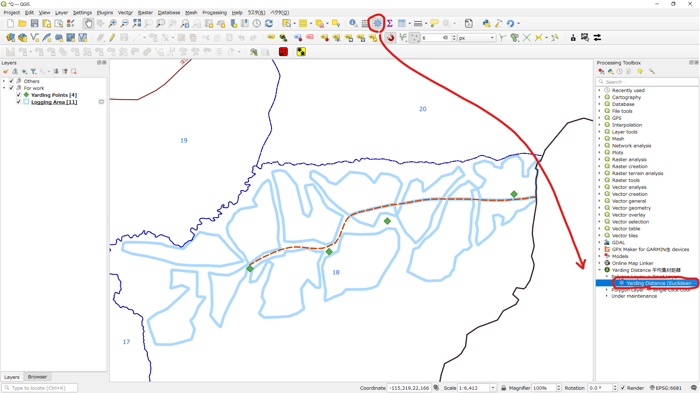
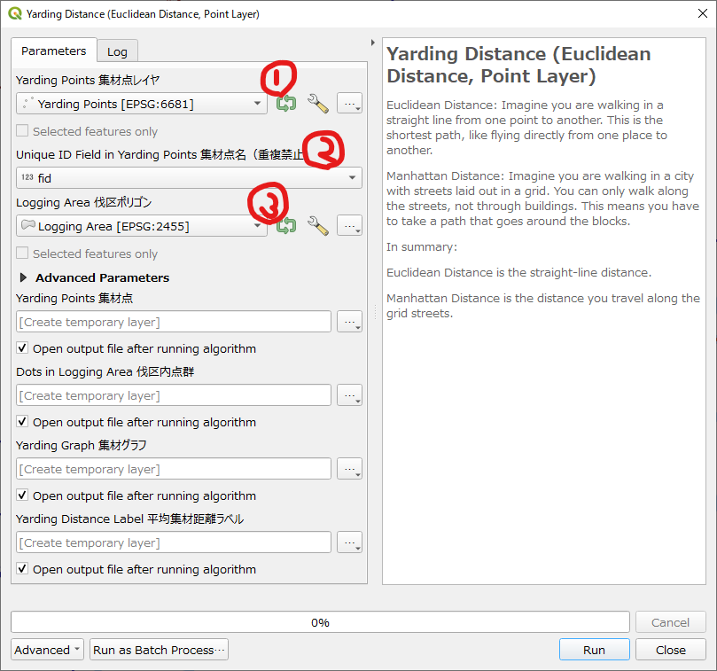
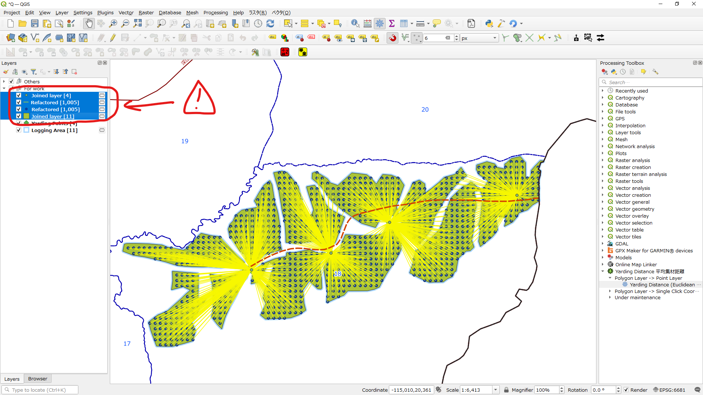
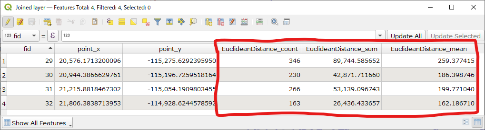

### Summary
This plugin calculates the “Yarding Distance,” which represents the average distance from a polygon to a point. 
The distance calculation is based on the coordinate system of polygon layer. Euclidean distance or Manhattan distance will be exported. 

### 概要
このプラグインは、ポリゴンからポイントまでの平均距離「平均集材距離」を計算します。 
距離の計算はポリゴンレイヤの座標系に基づいており、ユークリッド距離またはマンハッタン距離を出力できます。 

# How to Use
## Starting method
 
Launch Yarding Distance Plugin from the Processing Tools panel. 
## Setting method
 
Set parameters. 
## Generated layers
 
## Attribute values
 
